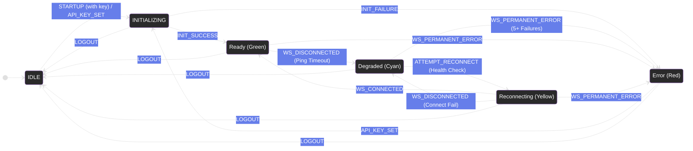

# ADR 0005: Service Worker State Machine for Robust Lifecycle Management

## Status

Accepted

## Context

The service worker's lifecycle logic was previously managed by a scattered collection of state flags, timers, and boolean variables (`initializationState.inProgress`, `isPollingMode`, `websocketClient`, etc.). This decentralized approach created several significant problems:

1.  **Unpredictable Behavior**: To understand the extension's current status, a developer had to inspect multiple, unrelated variables. The true state was an implicit combination of these flags, not an explicit, single source of truth.
2.  **Invalid States**: The system could easily enter contradictory or nonsensical states. For example, it was possible for a WebSocket connection attempt to be in progress while the system was simultaneously in "polling mode," leading to race conditions and unpredictable behavior.
3.  **Difficult Debugging**: State transitions were implemented as side effects hidden within various functions (`connectWebSocket`, `performPollingFetch`, etc.). Tracing the exact sequence of events that led to a specific state was extremely difficult, requiring developers to jump between multiple files and event handlers.
4.  **Flawed User Feedback**: The extension icon, which is the primary indicator of status for the user, was updated inconsistently. Transitions were often delayed or missed entirely. For instance, the icon would not turn red immediately upon repeated polling failures, and there was no visual feedback (a yellow icon) to indicate that the system was actively trying to reconnect.

**Example of the Problem:**

Determining the system's status required complex conditional logic that was brittle and hard to maintain.

```typescript
// Before: What state are we in? You have to check multiple, scattered flags.
if (
  initializationState.completed &&
  websocketClient &&
  websocketClient.isConnected()
) {
  // We're "ready"?
} else if (initializationState.completed && isPollingMode) {
  // We're "degraded"?
} else if (initializationState.inProgress) {
  // We're "initializing"?
}
// ... and what about reconnecting? There was no flag for that at all.
```

This complexity was the root cause of the bugs related to the icon status not updating correctly. A more robust, centralized, and explicit system for managing state was required.

## Decision

We will implement a formal **State Machine Pattern** to centralize all service worker lifecycle logic. This pattern establishes a single source of truth—the `currentState` variable—and enforces strict, well-defined rules for transitioning between states. This makes the system's behavior predictable, transparent, and resilient.

### States Defined

We have defined a set of explicit, mutually exclusive states that represent every possible phase of the service worker's lifecycle.

```typescript
export enum ServiceWorkerState {
  IDLE = "idle", // Initial state. No API key is present. The extension is inactive.
  INITIALIZING = "initializing", // API key exists. The system is actively fetching the initial user session data.
  READY = "ready", // Fully operational. Session data is loaded, and a real-time WebSocket connection is active.
  DEGRADED = "degraded", // Functionally online, but not optimal. The WebSocket is disconnected, and the system is using a slower HTTP polling mechanism as a backup.
  RECONNECTING = "reconnecting", // A short-lived, active state. The system is attempting to re-establish a WebSocket connection to transition from DEGRADED back to READY.
  ERROR = "error", // A terminal failure state. Both the WebSocket and the backup polling mechanism have failed repeatedly. The extension is effectively offline and requires user intervention.
}
```

### Events Defined

State transitions are not arbitrary; they can only be triggered by a predefined set of events. This prevents chaotic state changes and makes the logic easy to follow.

```typescript
export type ServiceWorkerEvent =
  | "STARTUP" // Fired by onInstalled or onStartup browser events.
  | "API_KEY_SET" // Fired when the user saves a new API key.
  | "INIT_SUCCESS" // Fired when the initial session data has been successfully fetched.
  | "INIT_FAILURE" // Fired when the session data fetch fails.
  | "WS_CONNECTED" // Fired when the WebSocket connection is successfully established.
  | "WS_DISCONNECTED" // Fired when the WebSocket disconnects for a transient reason (e.g., ping timeout, network blip).
  | "WS_PERMANENT_ERROR" // Fired for critical errors or after repeated failures.
  | "ATTEMPT_RECONNECT" // Fired by the health check alarm to trigger a reconnection attempt from the DEGRADED state.
  | "LOGOUT"; // Fired when the user logs out.
```

### State Transition Table

The core of the state machine is its transition logic, which dictates the allowed state changes based on the current state and the event received.

| Current State  | Event Trigger        | Next State     | Side Effect(s) to Run on Entry                                  |
| :------------- | :------------------- | :------------- | :-------------------------------------------------------------- |
| `IDLE`         | `STARTUP` (has key)  | `INITIALIZING` | `initializeSessionCache()`, set **Yellow Icon**                 |
| `IDLE`         | `API_KEY_SET`        | `INITIALIZING` | `initializeSessionCache()`, set **Yellow Icon**                 |
| `INITIALIZING` | `INIT_SUCCESS`       | `READY`        | `connectWebSocket()`, set **Green Icon**                        |
| `INITIALIZING` | `INIT_FAILURE`       | `ERROR`        | `showErrorNotification()`, set **Red Icon**                     |
| `READY`        | `WS_DISCONNECTED`    | `DEGRADED`     | Start periodic health check/poll, set **Cyan Icon**             |
| `READY`        | `WS_PERMANENT_ERROR` | `ERROR`        | `showErrorNotification()`, set **Red Icon**                     |
| `DEGRADED`     | `ATTEMPT_RECONNECT`  | `RECONNECTING` | `connectWebSocket()`, set **Yellow Icon**                       |
| `DEGRADED`     | `WS_PERMANENT_ERROR` | `ERROR`        | Stop all alarms, `showErrorNotification()`, set **Red Icon**    |
| `RECONNECTING` | `WS_CONNECTED`       | `READY`        | Stop all alarms, set **Green Icon**                             |
| `RECONNECTING` | `WS_DISCONNECTED`    | `DEGRADED`     | Start periodic health check/poll, set **Cyan Icon**             |
| `ERROR`        | `API_KEY_SET`        | `INITIALIZING` | `initializeSessionCache()`, set **Yellow Icon**                 |
| _Any State_    | `LOGOUT`             | `IDLE`         | `clearAllData()`, `disconnectWebSocket()`, set **Default Icon** |

### Implementation

The logic is encapsulated within a `ServiceWorkerStateMachine` class, which manages the `currentState` and orchestrates all transitions and side effects.

```typescript
// Pseudocode for the state machine class
class ServiceWorkerStateMachine {
  private currentState: ServiceWorkerState = ServiceWorkerState.IDLE;

  public async transition(event: ServiceWorkerEvent): Promise<void> {
    const nextState = this.getNextState(event);

    if (nextState !== this.currentState) {
      log(
        `[StateMachine] Transition: ${this.currentState} --[${event}]--> ${next.State}`,
      );

      // Run cleanup for the state we are leaving.
      await this.onStateExit(this.currentState);

      // Officially change the state.
      this.currentState = nextState;

      // Run actions for the new state we have entered.
      await this.onStateEnter(this.currentState);
    }
  }

  private getNextState(event: ServiceWorkerEvent): ServiceWorkerState {
    // Implements the logic from the transition table above.
  }

  private async onStateEnter(state: ServiceWorkerState): Promise<void> {
    // Runs all side effects, such as updating icons, starting timers,
    // and calling API functions via callbacks.
  }
}
```

## Consequences

### Pros

- **Predictable and Bulletproof**: The system can no longer enter an invalid state. The `currentState` variable is the single, unambiguous source of truth.
- **Explicit and Traceable Transitions**: State changes are now explicit actions (e.g., `transition('WS_DISCONNECTED')`) that are logged, making the flow of logic easy to follow and debug.
- **Immediate and Accurate User Feedback**: Because side effects like `updateConnectionIcon()` are tied directly to state entry (`onStateEnter`), the UI is guaranteed to reflect the system's internal state instantly. This fixed all bugs related to the icon color.
- **Highly Testable**: Each state and transition can be tested in isolation, allowing for comprehensive unit tests that verify every path through the lifecycle.
- **Self-Documenting**: The state diagram and transition table serve as clear and comprehensive documentation for the service worker's entire lifecycle, making it easy for new developers to understand.
- **Eliminates Race Conditions**: By centralizing state management, we prevent different parts of the code from modifying state flags concurrently. The `onAlarm` logic, for instance, is now deterministic and orderly.

### Cons

- **Initial Upfront Complexity**: Designing the state machine (defining all states, events, and transitions) required a significant initial investment in planning and design.
- **Learning Curve**: Developers on the team need to understand the State Machine pattern and the strict, event-driven flow it enforces, rather than calling functions directly.
- **Slightly More Verbose**: The code is more structured and slightly more verbose, as direct function calls are replaced with event-driven transitions (e.g., `connectWebSocket()` becomes `transition('ATTEMPT_RECONNECT')`). This is a worthwhile trade-off for the massive increase in robustness and maintainability.

### State Diagram


